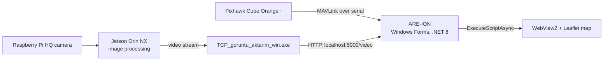

# ARE-İON — MAVLink Ground Control Station (C# / .NET)

A purpose-built ground control station (GCS) for the ARES team's fixed-wing UAV. It connects to a **Pixhawk Cube Orange+** over MAVLink, shows live telemetry, follows the aircraft on a satellite map and displays the video stream processed on board by a **Jetson Orin NX** with a **Raspberry Pi HQ camera**.

**Version 1 · 2024–2025** · C# · .NET 8 · Windows Forms


## What it does

During a flight the operator needs a few things on one screen: is the link alive, where is the aircraft, what is it doing, and what does its camera see. ARE-İON puts exactly those on a single window instead of a general-purpose GCS with dozens of panels:

- the **connection panel** (left) opens the telemetry link,
- the **telemetry widgets** (middle) show the flight data that matters,
- the **map panel** (top right) shows the aircraft and the flight area,
- the **video panel** (bottom right) shows the processed camera feed.

## Features

### MAVLink communication
- Serial telemetry link to the autopilot (57600 baud, selectable COM port).
- Reads the raw byte stream and decodes both **MAVLink v1** (`0xFE`) and **MAVLink v2** (`0xFD`) frames.
- Sends its own GCS `HEARTBEAT` once per second, with the X.25 checksum computed in the application.
- **Link watchdog**: connection status is tracked continuously, and a dropped port triggers an automatic reconnect.
- **Stale-data detection**: a value that has not been refreshed for 3 seconds is replaced with "veri alınamadı" (no data), so the operator never reads an old number as a live one.

### Telemetry widgets
Small single-purpose tiles, refreshed five times per second:

| Widget | Source | Notes |
|---|---|---|
| UAV link status | `HEARTBEAT` (0) | connecting / active / reconnecting |
| Latitude, longitude | `GPS_RAW_INT` (24) | 7 decimal places |
| GPS time | `GPS_RAW_INT` (24) | shown as local time |
| Yaw, pitch, roll | `ATTITUDE` (30) | converted from radians to degrees |
| Ground speed | `VFR_HUD` (74) | m/s |
| Acceleration | derived | change of ground speed over time, m/s² |

Tiles for server status, team number and autonomous mode are also part of the layout.

### Map panel
- An embedded **WebView2** browser running a **Leaflet** map with satellite imagery.
- Aircraft marker fed with the live GPS position.
- Flight-area boundary drawn as a polygon.
- Drawing tool: type coordinates to draw **polygons** (areas) and **circles** with a radius in m or km. Invalid lines are skipped and reported.
- Click on the map to drop a waypoint marker.

### Running JavaScript from C#
The map is a web page, the rest of the application is native. The two sides are connected by having C# execute JavaScript inside the page in the background (`ExecuteScriptAsync`): a timer pushes the latest position to the map five times per second, and helper methods send shapes to draw or clear. The page exposes plain functions (`setShapes`, `clearShapes`, the position update) as its interface, so the native side never touches the map internals.

### Video panel
- Shows the video processed on the aircraft (Jetson Orin NX + Raspberry Pi HQ camera), including the detection overlay.
- A companion process, `TCP_goruntu_aktarim_win.exe`, receives the stream and serves the latest frame locally over HTTP; the interface fetches it roughly 30 times per second.

### Server communication
- `api.exe` is the companion service for the data exchange with the server (receiving, processing and sending data).
- The connection panel holds the GCS URL, server URL, TCP and UDP fields and the server login/logout controls.

### NuGet packages
| Package | Used for |
|---|---|
| `MAVLink` | MAVLink message definitions and enums |
| `Microsoft.Web.WebView2` | the embedded browser behind the map panel |
| `System.Drawing.Common` | image handling for the video panel |

`Asv.Mavlink`, `MavSdk.Net`, `MavLink4Net.Messages` and `FrameworkOfAliveApplication.StandardBase.MAVLink` are also referenced in the project file but are not used by the current code.

## How it is built



The design separates *receiving* data from *showing* it:

1. **Receive.** The serial port raises an event whenever bytes arrive. The handler walks the buffer, finds MAVLink frames, and stores the decoded values together with the time they arrived.
2. **Show.** Independent UI timers (200 ms) copy those values into the widgets and into the map. Because the UI only reads the last known value, a burst of telemetry cannot flood or freeze the window.
3. **Connect.** Opening the port and waiting for the first heartbeat runs on a background task, so the window stays responsive while the link is being established.
4. **Isolate.** Video and server communication run as separate processes and are reached over local HTTP, so either can be restarted or replaced without touching the interface.

## Advantages

- **Focused.** Only what the team needs in flight, on one screen.
- **Resilient link.** Heartbeat watchdog, automatic reconnect and stale-data detection.
- **Responsive UI.** Telemetry reception and screen refresh are decoupled.
- **Rich map with little native code.** Leaflet does the map work; C# only drives it.
- **Modular.** Telemetry, video and server communication are independent pieces.
- **Easy to extend.** A new telemetry field is one more message ID in the parser and one more widget.

## Getting started

**Requirements**
- Windows 10 or 11
- Visual Studio 2022 with the ".NET desktop development" workload (.NET 8 SDK)
- Microsoft Edge WebView2 Runtime (already present on Windows 11)
- Internet access for the map tiles and the Leaflet scripts
- A telemetry radio or USB connection to the autopilot

**Run**
1. Clone the repository and open `ARES_Emir_AKAY.sln`.
2. Build and start with `F5`; NuGet packages are restored automatically.
3. Enter the COM port in **PORT NU** and press **BAGLAN**.
4. For video, start `TCP_goruntu_aktarim_win.exe`, then press **VİDEOYU GÖSTER**.

## Project structure

```
ARES_Emir_AKAY.sln
ARES_Emir_AKAY/
├── Form1.cs                      application logic: MAVLink, timers, map, video
├── Form1.Designer.cs             window layout
├── Program.cs                    entry point
├── api.exe                       server communication service
└── TCP_goruntu_aktarim_win.exe   video relay service
```

## Known limitations

Version 1 is a working prototype, not a finished product. The current shortcomings, stated openly:

**Map**
- The map script is in the middle of a merge with a newer map implementation and contains leftover text that stops it from loading. The position update is also still called under its old name (`updatePosition`) while the page now defines `updateUAV`.
- The aircraft icon is loaded from an absolute path on the developer's machine, so it does not appear elsewhere.
- Clicking the map places a waypoint marker, but the target is not yet passed on to the application or the autopilot.
- Map tiles and the Leaflet scripts are loaded online; there is no offline map.

**MAVLink**
- Read-only: apart from its own heartbeat, the interface sends nothing to the autopilot (no commands, no missions, no mode changes).
- Incoming frames are not checksum-verified, and a frame split across two serial reads is dropped.
- Serial only, and the baud rate is fixed at 57600; the baud field in the connection panel is not read.
- Only four message types are decoded. Altitude, battery, current and flight mode are not shown.

**Telemetry widgets**
- The acceleration value is a rough estimate from the change in ground speed, and its tile is also written by the unfinished altitude display, so it can show "no data" while speed is valid.
- The server status, team number and autonomous-mode tiles are not yet driven by the code.

**Server and video**
- The server login/logout buttons and the URL, TCP and UDP fields are laid out but not wired to any logic.
- `api.exe` and `TCP_goruntu_aktarim_win.exe` must be started by hand, and their source code is not part of this repository.
- Video is fetched as individual frames from a fixed local address rather than as a real stream.

**Code and interface**
- All logic lives in a single file (`Form1.cs`), and most controls still carry their default names.
- The layout uses fixed pixel positions designed for a 1920×1080 screen and does not scale.
- Windows only. There are no automated tests.

## Roadmap

**The project will continue to be developed**, starting with the limitations above:

- Repair the map script, bundle the aircraft icon with the application, add a heading-aware marker and forward map-click waypoints to the application.
- Wire the server login/logout and the URL, TCP and UDP fields into the interface.
- More telemetry: altitude, battery, current and flight mode.
- Send commands and missions to the autopilot, not only read from it.
- Checksum validation and proper buffering of incoming frames; MAVLink over UDP/TCP and a selectable baud rate.
- Split `Form1.cs` into separate telemetry, map and video components, and add a settings panel.

## Acknowledgements

Developed by **Emir Akay** ([@EmirAkay-007](https://github.com/EmirAkay-007)) within the ARES UAV team, with the contributions of Mr. Fatih AYIBASAN.
